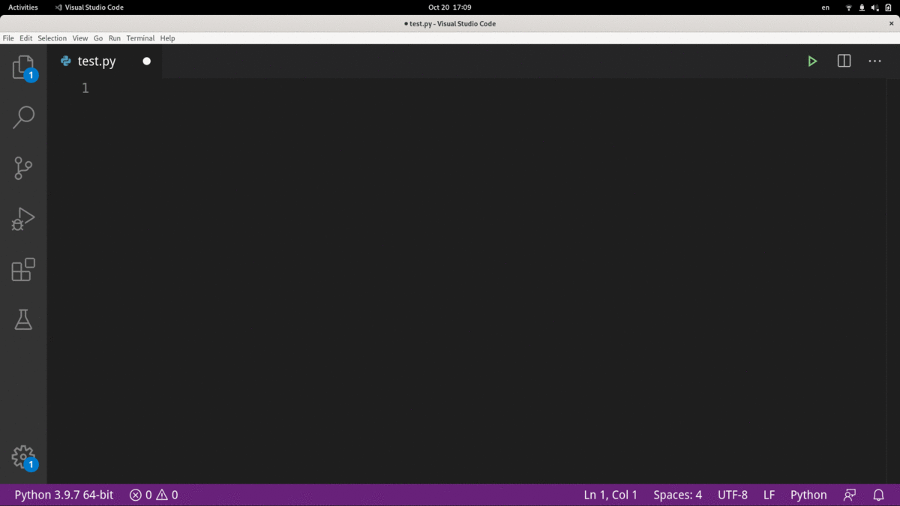

# refnow README

refnow provides often used snippsets, eg. doc templates, code quick start.

## Installation

### Install from marketplace

Install from marketplace directly by searching 'refnow' or click [here](https://marketplace.visualstudio.com/items?itemName=FrankLiang.refnow).

```bash
# code --install-extension FrankLiang.refnow
```

### Install from source code
Copy code [repo](https://github.com/liangxiao1/refnow) into `~/.vscode/extensions` directly and restart VS Code.

### Build .vsix from source code and install it

```bash
# npm install -g vsce
# vsce package
# code --install-extension <myextension>.vsix
```

### Public new .vsix on [marketplace](https://marketplace.visualstudio.com/VSCode) (maintainer use only)

```bash
# vsce login FrankLiang
# vsce ls
# vsce package
# vsce publish
```

## Usage

Type `rf` to call supported snippsets.


## Features

The list keeps updating.  

|Prefix | Description|
|-------|-------|
|rf_doc_case_checklist | TestCase best practise checklist, think more in new case design.
|rf_doc_case_docstring | Doc template for test case.|
|rf_py_argparse | Python argparse snippset|
|rf_py_concurrent.futures | Python run in parallel snippset|
|rf_py_logging | Python logging snippset|
|rf_py_signal | Python signal handler snippset|
|rf_py_yaml | Python yaml snippset|

## Contribution

You are welcomed to share your expertise by creating pull request or raise issue.  
Source on [github](https://github.com/liangxiao1/refnow).
